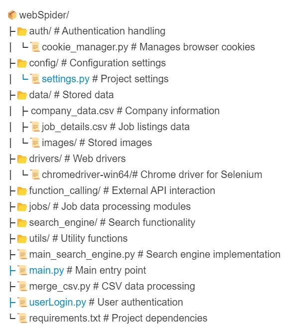

# Project Overview
WebSpider is a sophisticated web scraping and data analysis tool designed to collect, process, and analyze job-related information from various sources. It provides capabilities for searching job data, automating browser interactions, and making function calls to external APIs for enhanced data analysis.

# Features
- Job Data Scraping: Automatically extracts job information from various websites
- Search Engine Integration: Uses custom search engine to find specific job data
- Browser Automation: Utilizes Selenium with ChromeDriver for web interaction
- Authentication Management: Handles cookies and login sessions for accessing restricted content
- Data Storage: Saves collected data in structured CSV format
- Function Calling: Makes API calls to external services for additional data enrichment

# Project Structure




# How It Works
1. Web Scraping: The system automates Chrome browser using Selenium to navigate to job websites
2. Data Collection: It collects job listings, company information, and salary data
3. Data Processing: Collected data is cleaned and structured
4. Data Storage: Processed information is stored in CSV files for analysis
5. Search Functionality: Users can search for specific job information using natural language queries
6. API Integration: The system can make external API calls to enrich data with additional information


Usage Examples
For running the web spider
```python main.py```

Using function calling
```python function_calling/func_calling.py --prompt "What is the salary for entry level jobs at Shanghai City in China?"```


